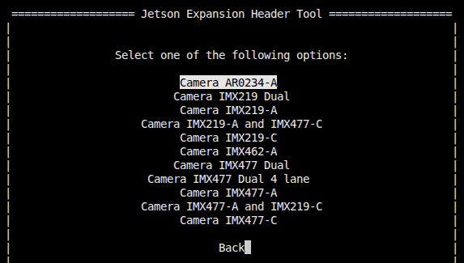
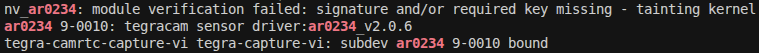

# ar0234 MIPI NVIDIA driver

Tested with NVIDIA Jetson Linux 36.4.4 (JetPack 6.2.1).

## Quickstart

Connect camera to `cam0` port.

> [!NOTE]
> Currently, only `cam0` port support is implemented.

---

Install required tools:

```bash
sudo apt install -y dkms
```

Clone the repository to your Jetson machine and navigate to the cloned directory:

```bash
cd ~
git clone https://github.com/Kurokesu/ar0234-mipi-nvidia.git
cd ar0234-mipi-nvidia/
```

---

Build and install:

```bash
sudo ./setup.sh
```

The setup script:
- Fetches NVIDIA device tree headers
- Installs the kernel module via [DKMS](https://github.com/dell/dkms), which automatically rebuilds the module and device tree overlay when the kernel is updated
- Builds and installs the device tree overlay (`.dtbo`) to `/boot` via a DKMS post-install hook

---

To install the ISP tuning file, run:

```bash
sudo cp ./tuning/camera_overrides.isp /var/nvidia/nvcam/settings
```

To uninstall and restore the default ISP parameters, remove the overrides file:

```bash
sudo rm /var/nvidia/nvcam/settings/camera_overrides.isp
```

---

Use the Jetson-IO tool to configure the 24-pin CSI connector:

```bash
sudo /opt/nvidia/jetson-io/jetson-io.py
```

Navigate through the menu:
1. Configure Jetson 24pin CSI Connector
2. Configure for compatible hardware
3. Select Camera AR0234-A



4. Save pin changes
5. Save and reboot to reconfigure pins

---

After reboot verify that the sensor is detected over I2C:

```bash
sudo dmesg | grep ar0234
```



## Image output

### GStreamer

```bash
gst-launch-1.0 -e nvarguscamerasrc sensor-id=0 ! \
   'video/x-raw(memory:NVMM),width=1920,height=1200,framerate=30/1' ! \
   queue ! nvvidconv ! queue ! nveglglessink
```

### NVIDIA sample camera capture application

```bash
nvgstcapture-1.0 --sensor-id 0
```

## Development builds

For manual builds without DKMS:

```bash
make              # build everything (dtbo + kernel module)
sudo make install # install to /boot and /lib/modules
```

Individual targets:

```bash
make dtbo      # build only the device tree overlay
make module    # build only the kernel module
make clean     # remove build artifacts
```

All build artifacts are placed in the `./build` directory.
